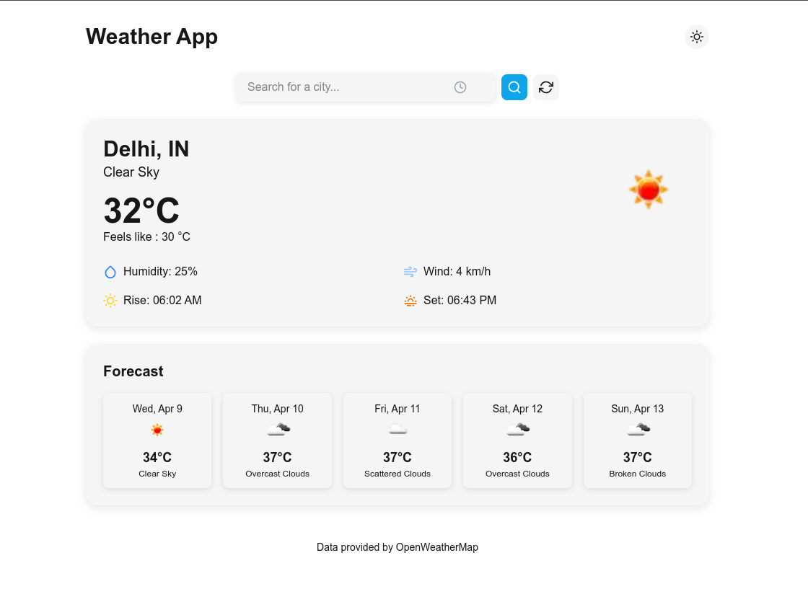

# Weather Dashboard

A responsive and interactive weather application that allows users to search for weather information by city name. Built with Next.js and the OpenWeatherMap API.



## Features

- ☁️ Current weather display with temperature, humidity, wind speed, etc.
- 📅 5-day weather forecast
- 🔍 City search with recent search history
- 🌓 Dark/Light mode toggle
- 📱 Fully responsive design
- 🔄 Refresh data button
- 📍 Automatic location detection (with permission)

## Tech Stack

- **Framework**: [Next.js](https://nextjs.org/) - React framework for production
- **Styling**: [Tailwind CSS](https://tailwindcss.com/) - Utility-first CSS framework
- **Animations**: [Framer Motion](https://www.framer.com/motion/) - Animation library for React
- **Icons**: [React Icons](https://react-icons.github.io/react-icons/) - Icon library
- **API**: [OpenWeatherMap API](https://openweathermap.org/api) - Weather data provider
- **State Management**: React Context API with custom hooks
- **Deployment**: Ready for deployment on Vercel/Netlify

## Setup Instructions

### Prerequisites

- Node.js 16.8.0 or later
- npm package manager

### Installation

1. Clone the repository:
   ```bash
   git clone https://github.com/VinamraSaurav/weather-app.git
   cd weather-app
   ```

2. Install dependencies:
   ```bash
   npm install
   ```


3. Create a `.env.local` file in the root directory with your OpenWeatherMap API key:
   ```
   OPENWEATHER_API_KEY=your_api_key_here
   ```

4. Start the development server:
   ```bash
   npm run dev
   ```
  

5. Open [http://localhost:3000](http://localhost:3000) in your browser to see the application.

## API Integration Details

This project uses the [OpenWeatherMap API](https://openweathermap.org/api) to fetch weather data. The integration includes:

1. **Current Weather Data**: 
   - Endpoint: `https://api.openweathermap.org/data/2.5/weather`
   - Data: Temperature, humidity, wind speed, weather conditions, etc.

2. **5-Day Weather Forecast**:
   - Endpoint: `https://api.openweathermap.org/data/2.5/forecast`
   - Data: 5-day forecast with 3-hour step data

### Rate Limits and API Key

- The free tier of OpenWeatherMap API has a limit of 60 calls/minute or 1,000,000 calls/month
- API calls are proxied through a Next.js API route to protect your API key
- To obtain an API key, register at [OpenWeatherMap](https://home.openweathermap.org/users/sign_up)

### Error Handling

The application includes error handling for:
- Invalid city names
- API request failures
- Location permission denials
- Network issues

## Future Improvements

- Add more detailed weather information (pressure, visibility, etc.)
- Implement weather maps using OpenWeatherMap's map layers
- Add hourly forecast for the current day
- Support for multiple locations/favorites
- Weather alerts and notifications

## License

This project is licensed under the MIT License - see the LICENSE file for details.